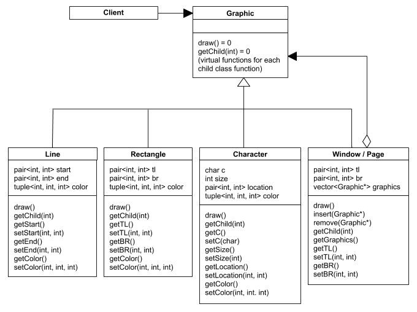
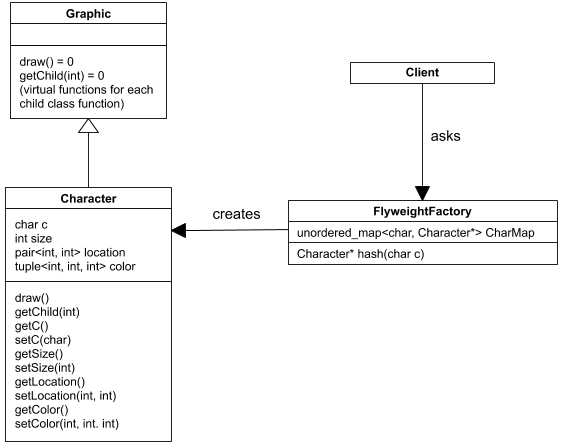
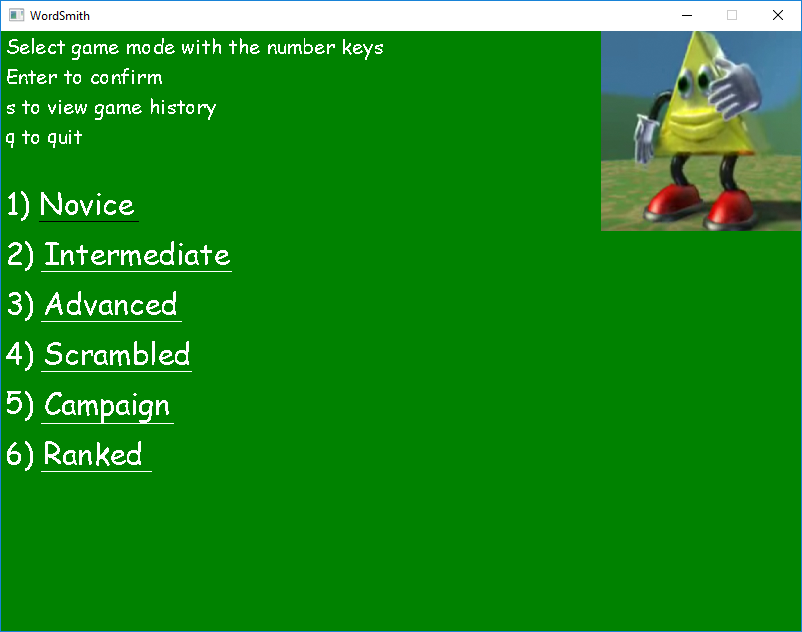
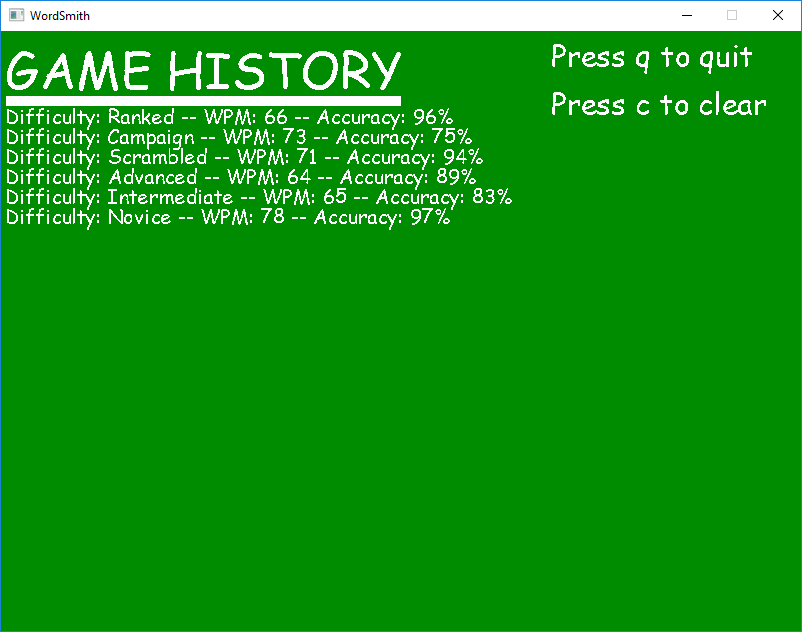
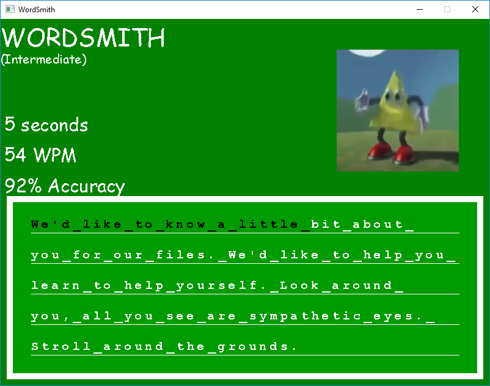
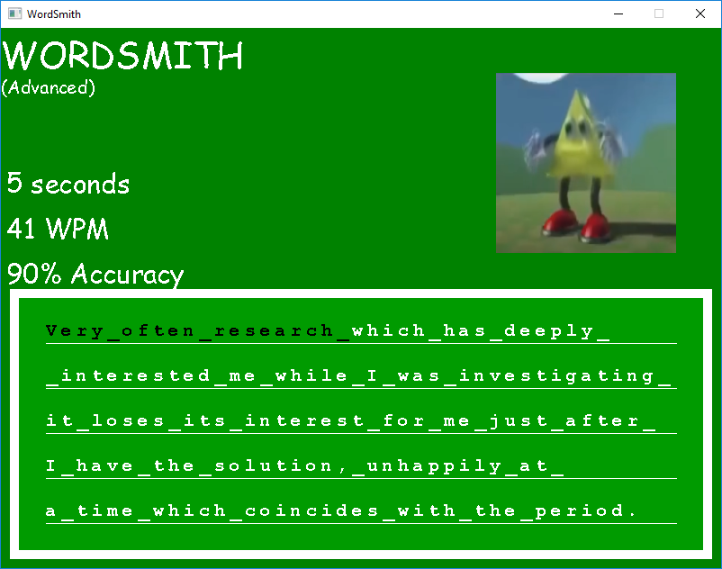
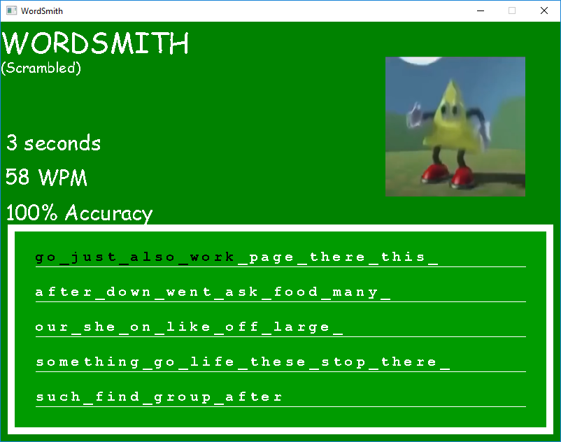
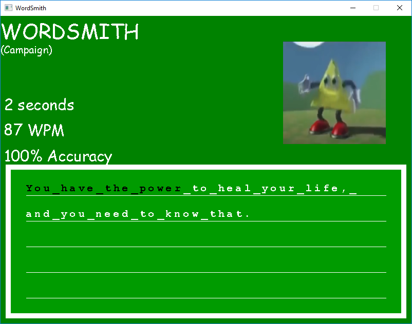
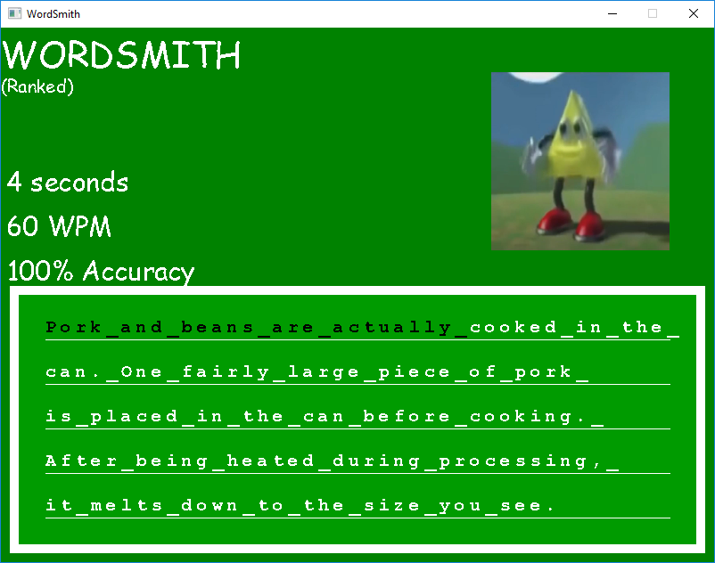
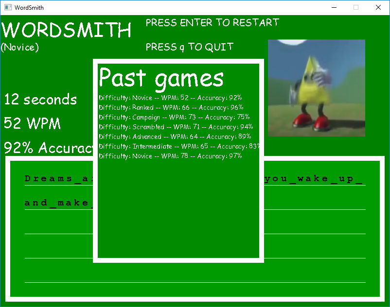

# WordSmith
 > Authors: [Albert Tambalo](https://github.com/alberttambalo), [Kimberly Yang](https://github.com/kimberlytyang), [Christopher Young](https://github.com/ChrisYoung1048)

## Project Description
 > * Typing proficiency is essential in today's academic and professional environment. One must develop this practical skill in order to improve performance in the workplace and save time when typing.
 > * Languages / Tools / Libraries / Technologies:
 >   * [C++11](https://en.cppreference.com/w/cpp/11) - C++11 is the second major version of the C++ programming language.
 >   * [SDL](https://www.libsdl.org/) - Simple DirectMedia Layer is a cross-platform development library designed to provide low level access to computer peripherals.
 > * Through the implementation of customizable typing exercises delivered through a user-friendly graphical interface, users can improve keyboard proficiency at their own pace.
 > * [Project Specifications](https://docs.google.com/document/d/1ejA8TL6ZKhy_L3s7JrmXWeAPj9ibm9LW2zqrtt7pb3Q/edit?usp=sharing)

## Class Diagram
 > * Composite Design Pattern: The composite design pattern is reflected in a hierarchy of graphic objects which can be organized into composite class objects and displayed on the GUI. 
 
 > * Strategy Design Pattern: The strategy design pattern uses a prompt selector to choose between 6 different prompt parsing algorithms. This pattern will allow the algorithm to be selected during runtime, depending on the desired prompt type. 
 
 > * Flyweight Design Pattern: The flyweight design pattern will be used during character object creation. It will use a hashmap to store character objects that have already been created so they can be reused when printing onto the screen, thus increasing efficiency and reducing memory usage. 
 
 
 ## Screenshots
 > * Main Menu 
 
  > * Game History 
 
  > * Novice Mode 
 
  > * Intermediate Mode 
 
  > * Advanced Mode 
 
  > * Scrambled Mode 
 
  > * Campaign Mode 
 
  > * Ranked Mode 
 
  > * Post-Game Screen 
 
 
 ## Installation/Usage
 > *For release version(No Visual Studio)*
 > * Clone the repository on a local machine using Git Bash
 > * Checkout into the GUI branch
 > * Open the folder titled "WordsmithRelease"
 > * Run Wordsmith.exe
 > *For non-release version(Visual Studio Required)*
 > * Clone the repository on a local machine using Git Bash
 > * Checkout into the GUI branch
 > * Open the folder titled "WordsmithVSproject"
 > * Open Wordsmith.sln
 > * Make sure the top drop-down menus say "debug" and "x86"
 > * Ctrl + B to build the project
 > * Press the play bar at the top
 
 ## Testing
 > * Continuous Integration: Testing was automated on pull requests to the master branch using GitHub Actions.
